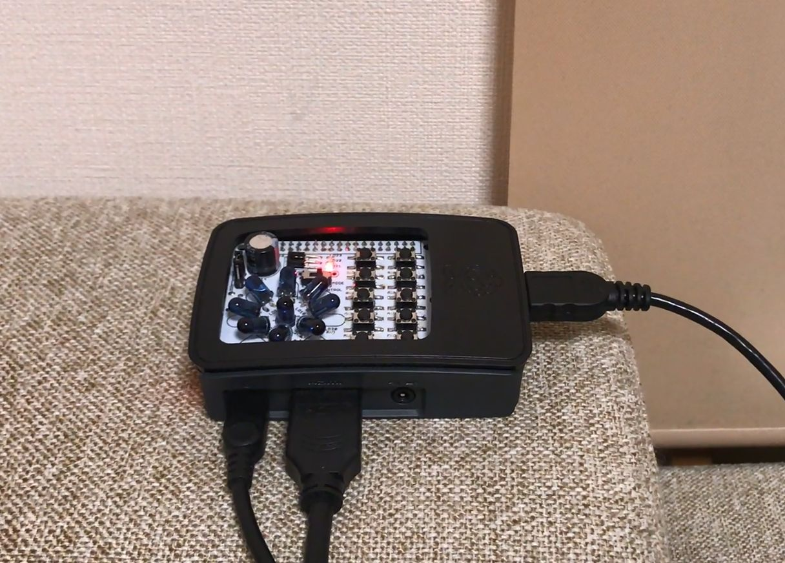
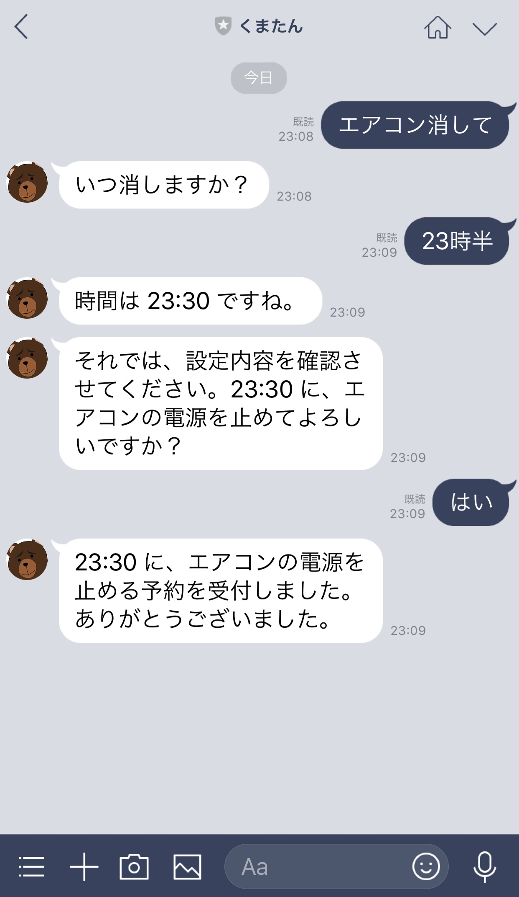
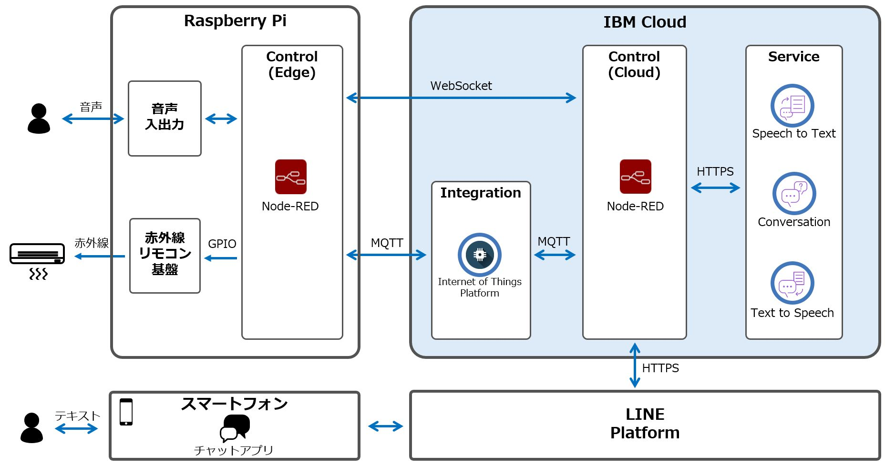
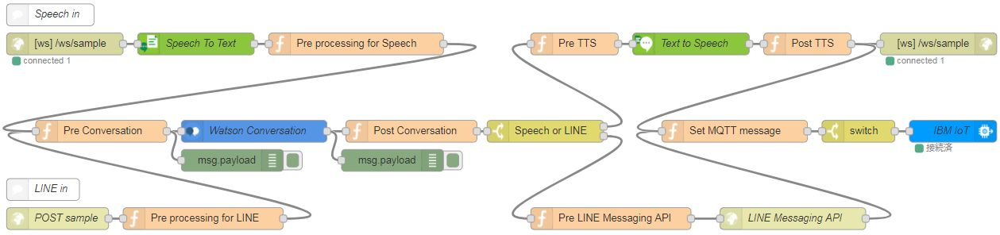
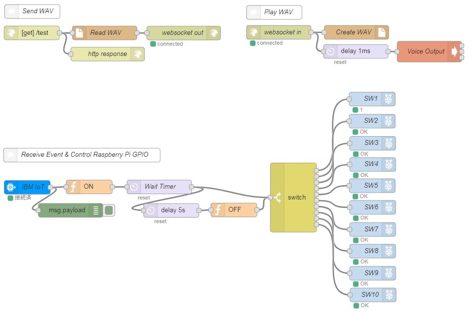

# 音声認識xIoTを活用したAIスピーカーデモアプリ

IBM Cloudのサービスで会話機能を実現した自作AIスピーカーのサンプルです。
音声入出力のインターフェースはRaspberry Piを利用し、IBM CloudのSpeech To Text、Conversation、Text To Speechサービスを通して音声による対話を実現しています。Raspberry Piには赤外線リモコンを接続し、対話内容に応じたエアコン電源操作も実現しています。クラウドからデバイスへのメッセージ送信にはInternet of Things Platformを利用しており、デバイス情報の収集もあわせて行っています。
また、スマートフォンのチャットアプリによる屋外からのエアコン操作も実現しており、帰宅前にあらかじめエアコンの電源をつけておくといった使い方も可能です。

## 1. アプリ概要

## 1-1. シナリオ１ - 屋内で音声操作

以下はエアコンをつける場合の対話例です。

- ユーザー：「Watson、エアコンつけて」
- Watson：「いつ付けますか？」
- ユーザー：「いま」
- Watson：「時間は 22:00 ですね。設定温度は何度にしますか？」
- ユーザー：「22度」
- Watson：「設定温度は 22 度ですね。それでは設定内容を確認させてください。22:00 に 22 度設定で、エアコンの電源を入れてよろしいですか？」
- ユーザー：「はい」
- Watson：「22:00 に 22 度設定で、エアコンの電源予約を受付しました。ありがとうございました。」

動画は [こちら](img/scenario1.mp4) よりダウンロードしてご覧ください。



## 1-2. シナリオ２ - スマホでチャット操作

以下はエアコンを消す場合の対話例です。



## 1-3. アプリ構成

本アプリのアーキテクチャー概要です。



#### 使用するIBM Cloud ライト・アカウント
1. Conversation
1. Speech To Text
1. Text To Speech
1. Internet of Things Platform Starter
	1. Internet of Things Platform
	1. Node-RED

#### 必要なハードウェア
1. Raspberry Pi本体（当サンプルではRaspberry Pi 3 MODEL Bを使用）
1. Micro SDカード
1. 電源用microUSBケーブル
1. HDMI接続ディスプレイとケーブル
1. USBマウス、USBキーボード
1. USBマイク、USBスピーカー
1. 赤外線リモコン送信のための電子部品

#### その他利用技術
1. Snowboy（ホットワード検出）
1. LINE Message API（LINEをインタフェースにする機能）

# 2. セットアップ手順（IBM Cloud）

#### 前提条件
- IBM Cloudのアカウントを所持していること

## 2-1. 各種カタログの作成
1. IBM Cloudにログインし、以下のカタログを作成します。サービス名、アプリ名、ホスト名は任意のものを入力します。プランはLiteを選択します。
	- Conversation（カテゴリー：Watson）
	- Speech To Text（カテゴリー：Watson）
	- Text To Speech（カテゴリー：Watson）
	- Internet of Things Platform Starter（カテゴリー：ボイラープレート）
1. Conversation、Speech To Text、Text To Speechは、サービス作成後に資格情報を追加し内容をメモします。
	- 各サービス管理画面の左メニュー「サービス資格情報」->「新規資格情報」->「追加」をクリック
	- 「資格情報の表示」より資格情報をメモ
1. Internet of Things Platform Starterは、Cloud Foundryアプリ作成後にホスト名をメモします。

## 2-2. Conversationのセットアップ
1. 作成したConversationのダッシュボードを開きます。
1. 「Create」の右のアイコン（Import workspace）をクリックし、「Choose a file」をクリックして[aispeaker-conversation.json](aispeaker-conversation.json)を選択します。
1. 「Everything（Intents, Entities, and Dialog)」にチェックが入っていることを確認して「Import」をクリックします。
1. 画面上部の「Watson Conversation」をクリックして、ワークスペース一覧画面を表示します。
1. インポートしたワークスペースの右上のアイコン（3点マーク）をクリックし「View details」をクリックします。
1. 「Workspace ID」をメモします。

## 2-3. Internet of Things Platformのセットアップ
1. Internet of Things Platform Starter作成時に追加されたInternet of Things Platformサービスのダッシュボードを開きます。
1. 画面左のメニューから「デバイス」をクリックします。
1. 「デバイス・タイプ」を選択し、 「+デバイス・タイプの追加」をクリックします。
1. タイプは「デバイス」を選択し、名前に任意の名前（例：RaspberryPi-DevType）を入力し「次へ」をクリックします。
1. 「完了」をクリックします。シリアル番号などはここでは不要です。
1. 「デバイスの登録」をクリックし、デバイスを追加します。
1. 「既存のデバイス・タイプの選択」で先ほど作成したデバイス・タイプを指定し、任意の「デバイスID」（例：RaspberryPi-001）を指定し「次へ」をクリックします。
1. 「次へ」をクリックします。シリアル番号などはここでは不要です。
1. 「次へ」をクリックします。認証トークンはここでは不要です。
1. 「完了」をクリックします。
1. 画面左のメニューから「アプリ」をクリックします。
1. 画面右上の「APIキーの生成」ボタンをクリックします。
1. 「説明」や「APIキーの有効期限」はデフォルトのまま、「次へ」をクリックします。
1. 「役割」は「デバイス・アプリケーション」を選択し「キーの生成」をクリックします。
1. 画面に表示される「APIキー」と「認証トークン」をコピペして保存します。
※この「認証トークン」はこの画面でしか見られず、後から再度表示したり確認したりすることはできないので注意下さい。万が一この「認証トークン」を紛失してしまった場合、「APIキーの生成」からやり直す事になります。

## 2-4. Node-REDのセットアップ
1. Internet of Things Platform Starter作成時に追加されたCloud Foundryアプリを開き、「アプリURLにアクセス」をクリックします。
1. Node-REDのWelcome画面が表示されます。右下の「Next」をクリックします。
1. 「Secure your editor so only authorised users can access it」にチェックが入っていることを確認し、任意の「Username」、「Password」を入力し、「Next」をクリックします。
1. 「Finish」をクリックします。
1. 「Go to your Node-RED flow editor」をクリックし、4.で設定したUsernameおよびPasswordでログインします。
1. Node-REDのフローエディターが開きます。Device Simulatorのサンプルフローが用意されていますが、今回は使用しないため削除します。（[Ctrl+A] でノード全選択後に[Delete]）
1. 右上のメニューより「読み込み」>「クリップボード」をクリックします。
1. [aispeaker-flow-cloud.json](aispeaker-flow-cloud.json)  をテキスト・ボックスに貼り付け、「読み込み」をクリックします。
1. Speech To Textノードを編集し、Speech To Textサービスの資格情報（手順2-1. で確認したもの）を設定します。
1. Text To Speechノードを編集し、Text To Speechサービスの資格情報（手順2-1. で確認したもの）を設定します。
1. Pre Conversationノードを編集し、ConversationサービスのワークスペースID（手順2-2. で確認したもの）と資格情報（手順2-1. で確認したもの）を設定します。
1. IBM IoTノードを編集し、「API Key」の設定にてInternet of Things PlatformサービスのAPI KeyおよびAPI Token（手順2-3. で確認したもの）を設定します。
1. 右上の「デプロイ」をクリックし、作成したフローをデプロイします。


[AI Speaker Flow Cloud JSON](aispeaker-flow-cloud.json) &nbsp;   |  &nbsp;  [AI Speaker Conversation JSON](aispeaker-conversation.json)

# 3. セットアップ手順（Raspberry Pi）

## 3-1. Raspberry Piの初期セットアップ
※今回は2017年11月29日リリースのRaspbian Stretch イメージを使用しました。
1. [RasberryPi.org](https://www.raspberrypi.org/downloads/raspbian) から、Raspbianの最新バージョンをダウンロードします。
1. [インストール手順](https://www.raspberrypi.org/documentation/installation/installing-images/README.md) に沿ってイメージをダウンロードし、SD カードに書き込みます。
1. 必要に応じてSSHやVNCなどの設定を行います。

## 3-2. Node-REDのセットアップ
1. 以下いずれかの方法にてNode-RED を開始します。
	- Desktopにて、Menu -> Programming -> Node-RED を選択
	- またはターミナルウィンドウから node-red-start を実行  
	※Raspberry Pi起動時にNode-REDを自動で開始するには次のコマンドを使用できます。
	```
	sudo systemctl enable nodered.service
	```
1. ブラウザーより以下URLにアクセスし、Node-REDのフローエディターを開きます。
	- http://<RaspberryPi_Host>:1880/
1. 右上のメニューより「パレットの管理」>「ノードを追加」をクリックし、以下のノードを追加します。
	- node-red-contrib-scx-ibmiotapp
1. 右上のメニューより「読み込み」>「クリップボード」をクリックします。
1. [aispeaker-flow-edge.json](aispeaker-flow-edge.json)  をテキスト・ボックスに貼り付け、「読み込み」をクリックします。
1. websocket outノードを編集し、「URL」の設定にてホスト名を手順2-1. で確認したものに設定します。
1. websocket inノードを編集し、「URL」の設定にてホスト名を手順2-1. で確認したものに設定します。
1. IBM IoTノードを編集し、「API Key」の設定にてInternet of Things PlatformサービスのAPI KeyおよびAPI Token（手順2-3. で確認したもの）を設定します。
1. 右上の「デプロイ」をクリックし、作成したフローをデプロイします。


[AI Speaker Flow Edge JSON](aispeaker-flow-edge.json)

※受信IoTイベントのメッセージ本体よりエアコンの電源および温度設定に関する命令内容を取得し、命令内容に応じて制御対象のGPIO番号を分岐させています。

## 3-3. 赤外線リモコンのセットアップ
GPIO経由で操作する赤外線リモコンを取り付け、GPIO番号とリモコン操作の紐付けを行います。（詳細な設定は本題と外れるため省略させて頂きます）

## 3-4. マイク、スピーカーのセットアップ
1. RaspbianにはALSAライブラリーがあらかじめインストールされているため、マイク使用のために何かをインストールする必要はありません。次のコマンドを使用して、マイクが動作しているかどうかをテストします。
	```
	arecord -r 32000 -d 3 /home/pi/temp/out.wav
	```
1. 次のコマンドを使用して録音した音声を再生します。
	```
	aplay /home/pi/temp/out.wav
	```
1. out.wav を再生して録音した音声が流れたら、IBM Cloudに音声をキャプチャーおよびストリーミングする準備ができたことになります。

## 3-5. ホットワード検出
ホットワードを発話してNode-REDフローを呼び出せるよう、ホットワード検出を追加します。当サンプルでは、ホットワード検出にサードパーティーライブラリー [Snowboy](https://snowboy.kitt.ai/) を使用します。Snowboy はカスタマイズ可能な、ローカルで動作するホットワード検出エンジンで、Raspberry Pi に直接使用できる互換性を持っています。
使用方法の詳細は、[こちら](http://docs.kitt.ai/snowboy/#quick-start) を参照下さい。

1. ホーム・ディレクトリにSnowboyバイナリーをダウンロードして解凍します。
	```
	cd ~/ && wget https://s3-us-west-2.amazonaws.com/snowboy/snowboy-releases/rpi-arm-raspbian-8.0-1.2.0.tar.bz2 
	tar -xvf ./rpi-arm-raspbian-8.0-1.2.0.tar.bz2
	cd rpi-arm-raspbian-8.0-1.2.0 
	```
1. テストスクリプトを実行します。
	```
	python demo.py resources/snowboy.umdl 
	```
1. スクリプトがリッスン中になったら、ホットワードの「Snowboy」を発音してください。ホットワードが認識されたことを示すビープ音が聞こえます。
1. ホットワードを「Watson」に変更し、ホットワードを聞き取るとホットワード検出を停止して IBM Cloud 呼び出しスクリプトを実行するようにします。
1. ~/rpi-arm-raspbian-8.0-1.2.0 ディレクトリーに、[watson-wake.py](watson-wake.py) および [watson.pmdl](watson.pmdl) を配置します。
1. 以下コマンドを実行します。
	```
	python watson-wake.py watson.pmdl
	```
1. スクリプトがリッスン中になったら、ホットワードの「Watson」を発音してください。ホットワードが認識されたことを示すビープ音が聞こえますので、続けてWatsonとの対話を行います。（Watsonの応答から10秒以上反応がないと、再びリッスン中の状態に戻ります。その場合、再度ホットワードの「Watson」を発音ください。）

1.  (オプション) 起動時にホットワードをリッスンするには、/etc/rc.local ファイルを編集してホットワードスクリプトを含めてください。
	```
	python ~/rpi-arm-raspbian-8.0-1.2.0/watson-wake.py ~/rpi-arm-raspbian-8.0-1.2.0/watson.pmdl & 
	```

# 4. セットアップ手順（LINE Bot）

#### 前提条件
- LINE Developersのアカウントを所持していること

## 4-1. LINE Botの作成
1. 以下のLINE DevelopersのURLから「Messaging API(ボット)をはじめる」をクリックします。
	- https://developers.line.me/ja/
1. LINEのメールアドレスとパスワードでログインします。
1. 新規Channel作成画面のサイドメニューから「新規プロバイダー作成」をクリックします。
1. 任意のプロバイダー名を入力し「確認」->「作成」をクリックします。
1. プロバイダーが作成された後「Messaging API」をクリックします。
1. 各項目を以下のように設定し、規約への同意にチェックした後「作成」をクリックします。
	- アプリ名：任意のアプリ名を入力（例：くまたん）
	- アプリ説明：任意のアプリ説明を入力
	- プラン：「フリー」を選択
	- 大業種・少業種：適切な項目を選択
	- メールアドレス：お知らせを受け取るメールアドレスを入力
1. 設定したアプリ名のボックスが表示されればBotの作成は完了です。

## 4-2. LINE DevelopersでのBot設定
1. 作成したBotの「Channel基本設定の画面」->「メッセージ送受信設定」->「アクセストークン(ロングターム)」から「再発行」をクリックします。
1. 表示されるポップアップウィンドウから「再発行」をクリックし、アクセストークンが入力されることを確認し、メモします。
1. Webhook送信の「利用する」を選択し「更新」をクリックし、Webhook URLに「<手順2-1. で設定したホスト名>/sample」を入力->「更新」をクリックします。
1. 「LINE@機能の利用」->「自動応答メッセージ」->「利用しない」を選択し「更新」をクリックします。
1. 「友だち追加時あいさつ」->「利用しない」を選択し「更新」をクリックします、
1. スマートフォンでLINEアプリを起動し、「その他」->「友だち追加」->「QRコード」でQRコードを読み込み、友だち追加します。
(全てのセットアップが終わると、友だち追加したBotを利用できるようになります)

## 4-3. LINE Messaging APIのアクセストークン設定

1. 手順2-4. で作成したNode-REDフローエディターを開きます。
1. Pre LINE Messaging APIノードを編集し、\<token\> に手順4-2. で確認したアクセストークンを設定します。
1. 右上の「デプロイ」をクリックし、編集したフローを再デプロイします。

